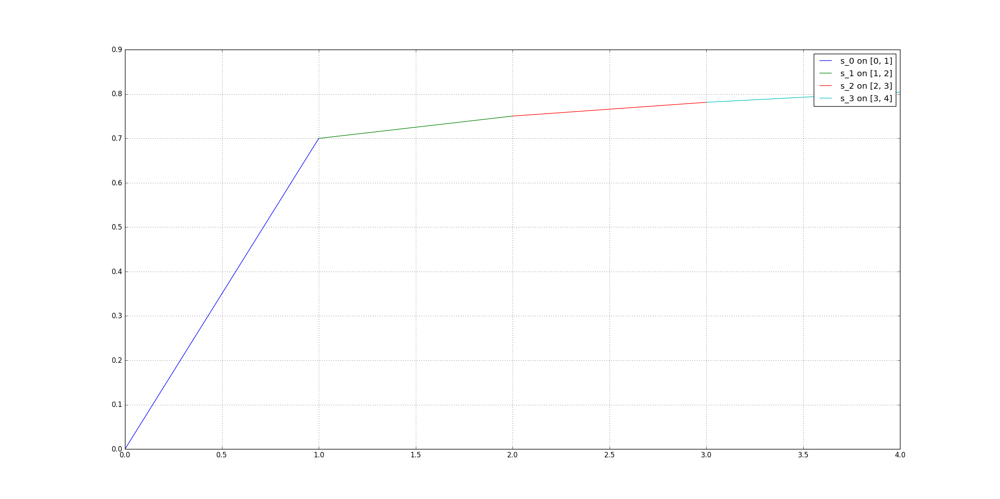
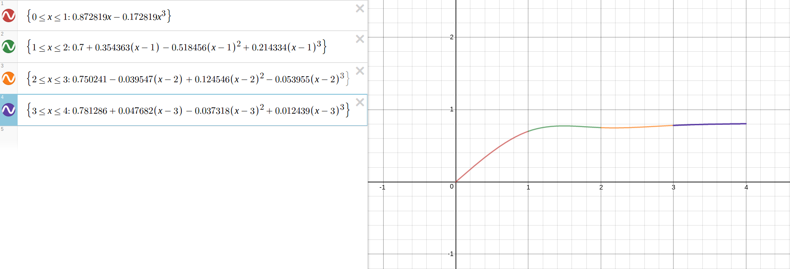

Using Student Learning Based on Fluency for the Learning Rate in a Deep Convolutional Neural Network for the Gamification of Information Security
==

The full paper may be read at [ResearchGate](https://goo.gl/phlQNY)

## Abstract
This is a proposal for mathematically determining the learning rate to be used in a deep supervised convolutional neural network (CNN), based on student fluency. The CNN model shall be tasked to imitate how students play the game _Packet Attack_, a form of gamification of information security awareness training, and learn in the same rate as the students did. The student fluency shall be represented by a mathematical function constructed using natural cubic spline interpolation, and its derivative shall serve as the learning rate for the CNN model. If proven right, the results will imply a more human-like rate of learning by machines.

## Citation
```
@article{agarap2017using,
        title={Using Student Learning Based on Fluency for the Learning Rate in a Deep Convolutional Neural Network for the Gamification of Information Security},
        author={Agarap, Abien Fred},
        journal={ResearchGate: DOI: 10.13140/RG.2.2.36501.73443},
        year={2017}
}
```

## Introduction
[Chen & Yi (2017)](https://arxiv.org/abs/1702.05663) successfully developed a deep convolutional neural network (CNN) that teaches a computer to play Super Smash Bros and Mario Tennis (both ran by using a Nintendo 64 emulator). However, like other neural networks\cite{Baird, Gupta, Jain, Lewandowsky, Negnevitsky, Riedmiller, Wilson}, the _learning rate_ in their model was a pre-programmed numerical constant. This research proposes to use a series of existing methods to mathematically determine what is the learning rate to be used in a neural network.

First, the aim is to measure the learning, based on fluency, of the players who will be subjected to the gamification of information security awareness traning. In this instance, the game to be played is about network packets, i.e. determining which is a _bad_ packet and a _good_ packet, named _Packet Attack_.

To accomplish the above goal, the data consisting the time of gameplay of players (_x-axis_) and the number of correct responses (_fluency_ in this context\cite{Chance}, _y-axis_) shall be the basis of constructing a mathematical function which will show the relationship between the data.

The mathematical function shall be constructed using _cubic spline interpolation_ since the graph of learning of individuals are usually not _smooth_, or in mathematical context, not differentiable at some points. The cubic spline interpolation produces a piecewise-polynomial function which gives a mathematical function at a specified interval like _[a,b]_ (see [Figure 1](figures/spline.png)). Hence, _smoothening_ the graph of learning (see [Figure 2](figures/spline_1.png)).



Figure 1: A piecewise-polynomial function on intervals _[0,1]_ (_s_0(x)_), _[1, 2]_ (_s_1(x)_), _[2, 3]_ (_s_2(x)_), and _[3, 4]_ (_s_3(x)_).



Figure 2: **{Smoothened:** A piecewise-polynomial function on intervals _[0,1]_ (_s_0(x)_), _[1, 2]_ (_s_1(x)_), _[2, 3]_ (_s_2(x)_), and _[3, 4]_ (_s_3(x)_) (graphed using [Desmos Calculator](https://www.desmos.com/calculator)).

In the present research, it is proposed to use the _rate of change_ (derivative) of the function from cubic spline interpolation as the _learning rate_ of the CNN. The learning rate in a neural network is crucial for it is the numerical entity which dictates how fast a machine learns a specified task. For the training of the CNN to learn how the human player plays, a close approach to what [Chen & Yi (2017)](https://arxiv.org/abs/1702.05663) did in their study, the gameplay frames (760x760 px images) and the coordinates of the packets and aim of the player shall be used as input. This approach shall be done to all players that will be involved in the study, as [Lewandowsky & Farrell (2011)](https://goo.gl/pp3x7H) pointed out that _individual fitting_ is more advantageous than generalizing.

The implication of using the learning (based on fluency in this study) as the basis for the learning rate in a neural network, specifically, deep convolutional neural network is significant for the point that not only does the machine learns how to play like a human, but also, learn in the same rate like humans do.